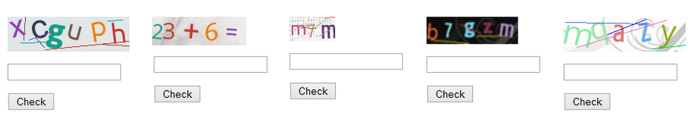

<p align="center"><a href="https://laravel.com" target="_blank"></a></p>

# laravel-10-capcha-2-math

Math Capcha varification in laravel 10. 
- Also see : [how to use captcha](https://github.com/suraj-repositories/laravel-10-capcha-1-string)


  
## Installation

The Captcha Service Provider can be installed via [Composer](http://getcomposer.org) by requiring the
`mews/captcha` package and setting the `minimum-stability` to `dev` (required for Laravel 5) in your
project's `composer.json`.

```json
{
    "require": {
        "laravel/framework": "5.0.*",
        "mews/captcha": "~2.0"
    },
    "minimum-stability": "stable"
}
```

or

Require the package for capcha with composer
   - Note : make sure the `extension=gd` is un-comment on your `C:/xampp/php/php.ini` file  
```sh
composer require mews/captcha
```

Update your packages with ```composer update``` or install with ```composer install```.

In Windows, you'll need to include the GD2 DLL `php_gd2.dll` in php.ini. And you also need include `php_fileinfo.dll` and `php_mbstring.dll` to fit the requirements of `mews/captcha`'s dependencies.


## Usage

To use the Captcha Service Provider, you must register the provider when bootstrapping your Laravel application. There are
essentially two ways to do this.

Find the `providers` key in `config/app.php` and register the Captcha Service Provider.

```php
    'providers' => [
        // ...
        'Mews\Captcha\CaptchaServiceProvider',
    ]
```
for Laravel 5.1+
```php
    'providers' => [
        // ...
        Mews\Captcha\CaptchaServiceProvider::class,
    ]
```

Find the `aliases` key in `config/app.php`.

```php
    'aliases' => [
        // ...
        'Captcha' => 'Mews\Captcha\Facades\Captcha',
    ]
```
for Laravel 5.1+
```php
    'aliases' => [
        // ...
        'Captcha' => Mews\Captcha\Facades\Captcha::class,
    ]
```

For Laravel 11 : you do not need to add the alias, it will be added automatically.

## Configuration
### Custom settings:
To use your own settings, publish config.

```sh
 $ php artisan vendor:publish
```
- the above command will create the file `config\captcha.php` in which you can make configuration related to captcha
- for example if you want to make any customization
`config/captcha.php`

```php
return [
    'default' => [
        'length' => 4,
        'width' => 120,
        'height' => 36,
        'quality' => 90,
        'math' => true,      # make the math to true to enable math captcha
        'expire' => 60,
        'encrypt' => false,
    ],
    // ... other
];
```
### Disable validation:
To disable the captcha validation use `CAPTCHA_DISABLE` environment variable. e.g. **.env** config:

```php
CAPTCHA_DISABLE=true
```


## Example Usage
- getting the image in view file `resources\views\contact.blade.php`
```html
<div class="d-flex">
   {!! captcha_img('math') !!}             {{-- use math as a parameter captcha for image function --}}
   <div class="ms-2">
         <input type="text" name="captcha" class="form-control">
         @if ($errors->has('captcha'))
            <small class="mt-1 text-danger">{{ $errors->first('captcha') }}</small>
         @endif
   </div>
</div>
```
- controller code `app\Http\Controllers\ContactController.php`
```php
public function store(ContactRequest $request){
        $contact = Contact::create($request->validated());
        return $contact;
}
```

- The `app\Http\Requests\ContactRequest.php` is validating the request for captcha
```php
class ContactRequest extends FormRequest
{
  public function authorize(): bool
    {
        return true;
    }

    public function rules(): array
    {
        return [
            'captcha' => 'required|captcha',
            'name' => 'required',
            'email' => 'required|email',
            'message' => 'required',
        ];
    }

    public function messages(){
        return ['captcha.captcha' => 'Invalid captcha!']; # to customize the validation message
    }
}
```


### Return Image
```php
captcha();
# or
Captcha::create();
```


### Return URL
```php
captcha_src();
# or
Captcha::src('default');
```

### Return HTML
```php
captcha_img();
# or
Captcha::img();
```

### To use different configurations
```php
captcha_img('flat');

Captcha::img('inverse');
```

